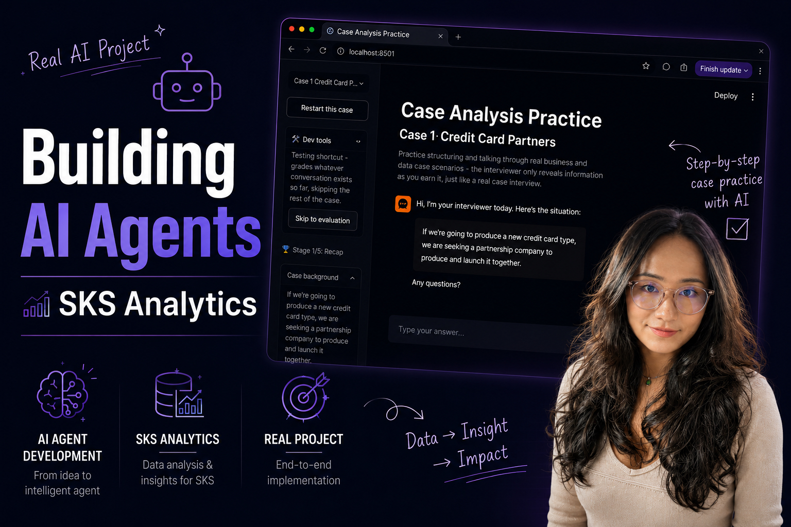
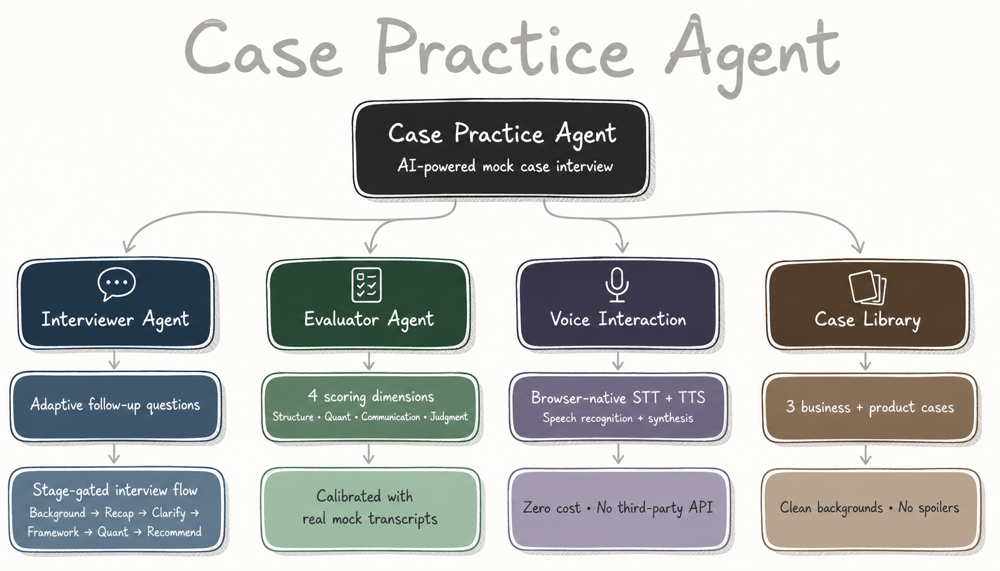

# 🧠 Case Analysis Practice: A Multi-Agent AI System

A **multi-agent AI system** that acts as a sparring partner for case practice, and more broadly, for
the kind of open-ended business reasoning that shows up on the job long after the interview is over.

If you've done business-analyst, product-analyst, or data-analyst work, you've probably lived some
version of this: someone hands you a vague, half-finished business question, expects you to structure
it, run the numbers, and defend a recommendation out loud. Sometimes there's an added twist too, like
an **A/B test** whose result isn't as clean as the dashboard makes it look. Case interviews are really
just a compressed, adversarial version of that same skill. This project is a tool for practicing it:
**two AI agents** play the roles of a real interviewer and a real evaluator, so you can run through a
case, get pushed on your logic in real time, and walk away with a specific, **evidence-based
scorecard** instead of a vague "good job."

It started as prep for one company's case-interview pack. It grew into something more general on
purpose. The **three practice cases** in this repo span a classic profitability case, a partnership
evaluation, and a ride-share tipping-prompt A/B test, because "can you structure an ambiguous problem
and reason about a rollout decision from experiment data" is a skill that runs straight from consulting
case interviews into everyday data-analyst work.

## 🎥 Demo

[](https://youtu.be/7tmW1r0ezLY)

👆 **Click the image above to watch the full demo on YouTube:** picking a case, working through the
stages, getting pushed back on by the interviewer, and reading the final scorecard.

## 🏗️ Architecture



Two agents, two very different jobs.

### 🎙️ The Interviewer Agent

Runs the live conversation, and its whole design point is that it acts as a **gatekeeper of
information** rather than a script-reader. A real interviewer doesn't hand you the full case packet,
every data point, and the final question all at once. You have to earn each layer by doing what's
expected of you at the current stage:

`Background → Recap → Clarifying Questions → Framework → Quantitative Analysis → Recommendation`

Concretely: you get the business situation, then you have to **play it back in your own words**
before anything else unlocks. Clarifying questions are yours to ask (or skip), and the interviewer
never prompts for them. You have to **propose your own structure** before any numbers appear. Each
quantitative sub-question arrives with its full data set the moment you earn it, but never with the
equation. That part has to come from you. And the case closes with a **Conclusion → Data → Risks →
Next Steps** recommendation that gets pushed back on at least once before it's accepted.

### 📊 The Evaluator Agent

Never sees the interview live. It only reads the finished transcript, once, at the end, and scores it
on four dimensions: **Structured Thinking, Quantitative Analysis, Communication,** and **Business
Judgment**, each 1 to 5, with one specific, evidence-based comment per dimension (never "good job" or
"needs work"). Any dimension scoring below a 3 fails the round. These four dimensions get graded across
the *whole* conversation, not one per interview stage. More on why that distinction mattered below. 👇

## 🛠️ Tech Stack

- **Python + Streamlit** for the web UI, no hand-rolled HTML/CSS/JS required to get a real interface
- **Anthropic's Claude API** powers both agents (the interviewer and the evaluator are two
  independently-prompted agents, not one model wearing two hats)
- **Voice, entirely free 🎤:** the browser's own native Web Speech API. `SpeechRecognition` turns your
  spoken answer into text, `SpeechSynthesis` reads the interviewer's replies back to you. No speech
  vendor, no extra API key, no added cost. Works out of the box in Chrome/Edge.

## 💡 Design Decisions (a.k.a. what actually took the time)

### 1. The stage-gating logic only got real once I played candidate against it myself

The six-stage flow above looks clean on paper, but every actual bug in it surfaced from **sitting down
and running real conversations**, not from re-reading the system prompt. A few of the ones that only
showed up that way: the interviewer would **spoil later-stage content** in its very first message,
mentioning a topic that was only supposed to come up once a clarifying question earned it. Left to its
own devices, it would happily **state the equation** for a quant question instead of waiting for the
candidate to propose one. It could get stuck **redirecting the candidate on the same sticking point**
forever with no way out. And it would sometimes treat "clarifying questions" as a checklist to
complete, insisting on goal, scope, *and* time horizon, instead of accepting one sharp, well-targeted
question and moving on, which is what a real interviewer does. Every one of these got fixed by
**noticing it happen live**, not by reasoning about the prompt in the abstract.

### 2. The evaluator's rubric got thrown out and rebuilt once, on purpose

My first version scored five dimensions that mirrored the five interview stages one to one: Recap,
Clarifying, Framework, Quant, Recommendation. It felt obviously right at the time, since I'd designed
both around the same mental model. Then I looked up the actual, **publicly documented Capital One
case-interview scoring rubric**, and it scores on four *different* dimensions: **Structured Thinking,
Quantitative Analysis, Communication, Business Judgment**, applied across the whole transcript, not one
per stage. That was the moment it clicked that I'd conflated two genuinely different things: the
interview **flow** controls *when* information gets revealed, while the scoring **rubric** grades the
*quality* of what you did with it. A sloppy recap doesn't deserve its own "recap dimension." It just
costs you Structured Thinking or Communication points, depending on what specifically went wrong with
it. Once I saw that distinction, the old five-dimension version wasn't a small patch away from correct.
It needed a **full rebuild**.

### 3. Calibrating a subjective scorer isn't a math problem, so I stopped treating it like one

Once the four-dimension rubric was in place, the obvious next question was: how do I know the new
evaluator's scores are actually *good*? My first instinct was to run the same transcript through the
old and new versions and compare the numbers. Then I realized that comparison proves nothing. Grading a
case interview is an **open, judgment-based call**, not a problem with one correct numeric answer, so
lining up two uncalibrated scales against each other doesn't tell you which one, if either, is right.
What actually matters is whether the **reasoning** behind a score holds up. So instead of chasing
numeric agreement, I fed the evaluator **real transcripts from mock interviews I'd actually done**,
read its stated reasoning, and judged for myself whether it held water. Turns out that's exactly how
subjective scoring gets calibrated in the real world too. Consulting firms, medical licensing exams
(OSCE), and hiring panels all **"calibrate"** scorers by having them discuss *why* a score was given
against real evidence until judgment aligns, not by chasing a single canonical number. 🎯

### 4. The scope grew on purpose, not by accident

This didn't start out as a general tool. It started as practice for one specific interview pack.
Widening it into "Case Analysis Practice," covering both classic business-case structuring and the
kind of everyday product/data-analyst reasoning a live experiment result demands, was a **deliberate
reframe**. Less "help me pass one interview," more "build (and show) the actual reasoning skill, and
the AI-agent design behind practicing it."

## 🚀 Running It Locally

```bash
git clone https://github.com/moshuhuang/case-analysis-practice.git
cd case-analysis-practice
python3 -m venv .venv
source .venv/bin/activate      # Windows: .venv\Scripts\activate
pip install -r requirements.txt

cp .env.example .env
# open .env and paste in your own Anthropic API key

streamlit run app.py
```

Grab an API key at [console.anthropic.com](https://console.anthropic.com) if you don't have one. It's
billed separately from a Claude.ai subscription, pay-as-you-go. Use Chrome or Edge for the voice
features (Web Speech API support elsewhere is partial to absent). Everything else works in any modern
browser. `localhost` already satisfies the "secure context" requirement the speech APIs need, so no
HTTPS setup is required for local use.

## 🔒 A Note on Security

`.env` is listed in `.gitignore` and has never been committed to this repository's history. There is no
real API key anywhere in this repo, only the placeholder in `.env.example`. This project is meant to be
cloned and run locally with your own key. There is no hosted/deployed version of it running anywhere,
so there's nothing live to point a browser at except what you run yourself.

---

Built by [@moshuhuang](https://github.com/moshuhuang) 👋
